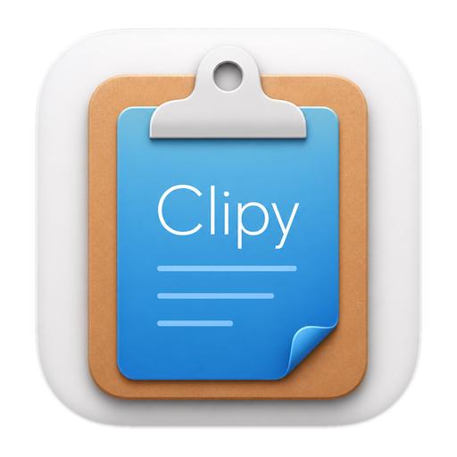

  

# Clipy2

Clipy2 is a clipboard extension app for macOS. It keeps clipboard history close at hand and lets you save reusable snippets for quick pasting.

Clipy2 is a maintained fork of the original [Clipy](https://github.com/Clipy/Clipy) project, which is no longer maintained. This fork keeps the core Clipy workflow while updating the app for current macOS releases.

## Requirements

macOS 14 Sonoma or later.

## Download

Download the latest release from [clipy2.fldr.zip](https://clipy2.fldr.zip) or the [GitHub releases page](https://github.com/mergd/Clipy2/releases/latest).

## Build

Open `Clipy.xcworkspace` in Xcode and build the `Clipy` scheme.

Dependencies are managed with CocoaPods and are checked into this repository.

## License

Clipy2 is available under the MIT license. See [LICENSE](./LICENSE) for more information.

Clipy is based on [ClipMenu](https://github.com/naotaka/ClipMenu), originally published as open source by [@naotaka](https://github.com/naotaka). See [LICENSE_CLIPMENU](./LICENSE_CLIPMENU) for the ClipMenu license.
